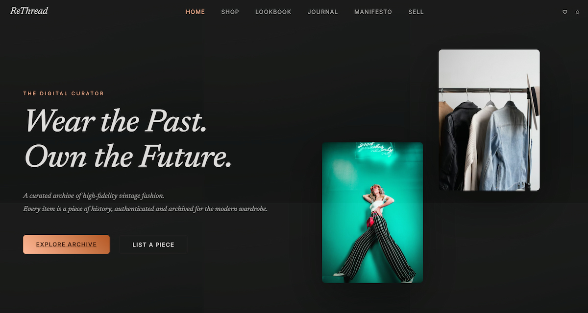
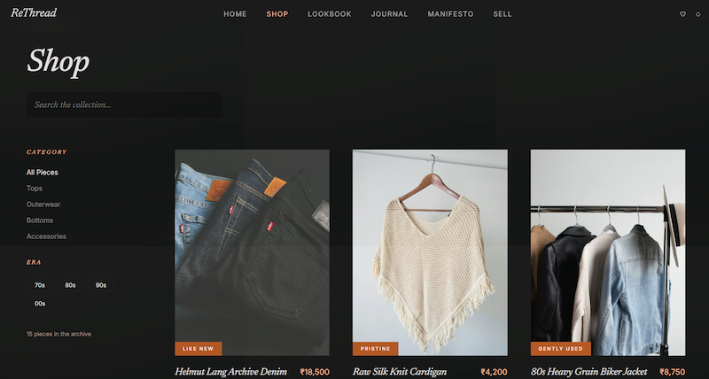
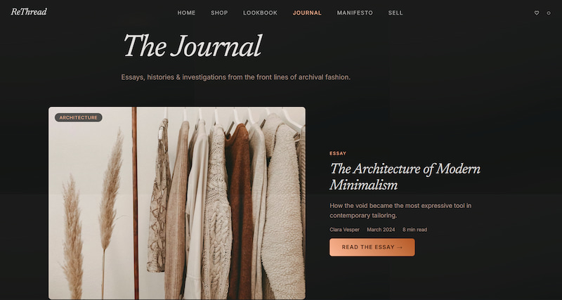
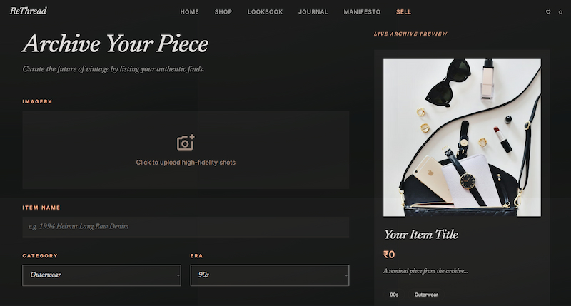

<div align="center">

# 🧵 RETHREAD

### *Where archival fashion meets editorial design.*

<br/>

[](https://react.dev/)
[](https://vitejs.dev/)
[](https://reactrouter.com/)
[](https://developer.mozilla.org/en-US/docs/Web/CSS)
[](https://re-thread-qeng.vercel.app/)

<br/>

> A high-fidelity React application that blurs the line between a luxury fashion magazine and a fully functional e-commerce experience — built for archival clothing and conceptual streetwear.

<br/>

### 🌐 [Live Demo → re-thread-qeng.vercel.app](https://re-thread-qeng.vercel.app/)

<br/>




</div>

---

## 📖 About

ReThread is a sophisticated digital platform that blurs the line between a high-end fashion magazine and an exclusive e-commerce experience. Through a carefully curated UI and smooth client-side interactions, it allows users to discover, collect, and trade archival fashion pieces.

The project emphasises visual storytelling, performance, and clean architecture — inspired by modern editorial design systems and premium fashion retail UX.

---

## ✨ Features

- **Editorial Experiences** — Immersive content pages including *Manifesto*, *Journal*, and *Lookbook* with rich typography and layouts
- **Interactive Commerce** — Complete shopping workflow: Shop → Product Details → Cart → Wishlist → Sell
- **Dynamic Routing** — Parameterised routes like `/product/:id` and `/archivist/:handle`
- **Client-Side State Management** — Persistent state using `localStorage` with React Hooks
- **Premium UI/UX** — Smooth transitions, clean typography, and design consistency throughout

---

## 🏗️ Architecture

> 👉 [View Full Interactive Architecture Diagram](https://github.com/Shree-svg/ReThread/blob/main/docs/architecture.html)

**Architecture at a glance:**

```
Single Page Application (SPA)
│
├── Global state lifted to App.jsx
├── Props-based state sharing across components
├── Persistent storage via localStorage
├── Component-driven architecture
└── React Virtual DOM optimisation
```

---

## 🛠️ Tech Stack

```
React 19          →  Component architecture & UI
Vite 5            →  Lightning-fast build tooling & dev server
React Router v7   →  Dynamic client-side routing (zero page reloads)
Vanilla CSS       →  Custom design system via CSS variables & modules
localStorage      →  Client-side state persistence
ESLint            →  Code consistency & quality
```

---

## 📂 Project Structure

```
ReThread/
├── public/                  # Static assets, SVG icons, favicons
├── docs/
│   └── architecture.html    # Interactive system design diagram
├── src/
│   ├── components/          # Reusable UI components
│   ├── pages/               # Route-level page components
│   │   ├── Home.jsx
│   │   ├── Shop.jsx
│   │   ├── Sell.jsx
│   │   ├── ProductDetail.jsx
│   │   ├── Cart.jsx
│   │   ├── Wishlist.jsx
│   │   ├── Manifesto.jsx
│   │   ├── Journal.jsx
│   │   └── Lookbook.jsx
│   ├── App.jsx              # Root component, router & global state
│   └── main.jsx             # Entry point
├── index.html
├── vite.config.js
└── package.json
```

---

## 🔄 State Management

Centralised state lives in `App.jsx` and flows down via props:

| Hook | Purpose |
|---|---|
| `useState` | Cart, wishlist, and UI state |
| `useEffect` | Syncing state to `localStorage` |
| `useParams` | Dynamic product/archivist routes |
| `useNavigate` | Programmatic navigation |

---

## 🚀 Getting Started

```bash
# 1. Clone the repository
git clone https://github.com/harshchauhan121/ReThread.git
cd ReThread

# 2. Install dependencies
npm install

# 3. Start the development server
npm run dev

# 4. Build for production
npm run build
```

Open [http://localhost:5173](http://localhost:5173) in your browser.

---

## 📸 Screenshots

| Shop | Journal | Sell |
|---|---|---|
|  |  |  |

## 🎯 Key Highlights

- 📌 High-fidelity UI inspired by editorial fashion design
- 📌 Real-world e-commerce flow — from browsing to cart to wishlist
- 📌 Dynamic parameterised routing for products and archivists
- 📌 Optimised rendering using React Virtual DOM
- 📌 Clean, scalable component architecture

---

## 🔮 Future Improvements

- 🔐 Authentication — Login / Signup flow
- 🌐 Backend integration — Node.js or Firebase
- 💳 Payment gateway integration
- 📦 Order management system
- 📊 Admin dashboard for sellers

---

## 👥 Authors

This was an equal collaboration — conceived together, pair-programmed throughout, and pushed from one machine (standard in collab projects).

<table>
  <tr>
    <td align="center">
      <a href="https://github.com/harshchauhan121">
        <b>Harsh Chauhan</b>
      </a>
      <br/>
      <sub>Page concepts · Content direction · UI ideation · Co-development</sub>
    </td>
    <td align="center">
      <a href="https://github.com/Shree-svg">
        <b>Shreedhar (Shree-svg)</b>
      </a>
      <br/>
      <sub>Component architecture · Routing setup · Co-development</sub>
    </td>
  </tr>
</table>

---

## ⭐ Support

If you like this project, consider giving it a ⭐ on GitHub!

---

<div align="center">
  <sub>ReThread © 2025 · Built with React + Vite · <a href="https://re-thread-qeng.vercel.app/">Live Demo</a></sub>
</div>
